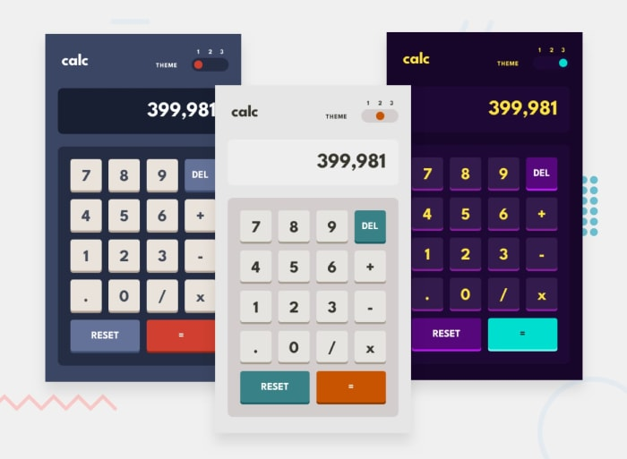

# Calc



- Live Preview ⭕🔗: https://calculator-app-six-nu.vercel.app

## Introduction

Welcome to **Calc**, a simple calculator app that allows users to perform basic arithmetic operations such as addition, subtraction, multiplication, and division. It uses React and Redux for state management.

## Features

Calc features a user-friendly interface with a responsive design that adapts to different screen sizes. It also provides a dark mode theme for a more visually appealing experience.

It follows the principles of single-page application (SPA) architecture, where the user interacts with the app on a single page without the need for multiple page reloads.

## Technologies Used

Calc is built using the following technologies:

- HTML5
- SCSS
- Typescript
- Reactjs
- Redux Toolkit

## Installation

To run Calc locally on your machine, follow these steps:

1. Clone the repository:

   ```bash
   git clone https://github.com/MostafaSaafan5517/calculator-app.git
   ```

Enjoy Coding 👨‍💻
